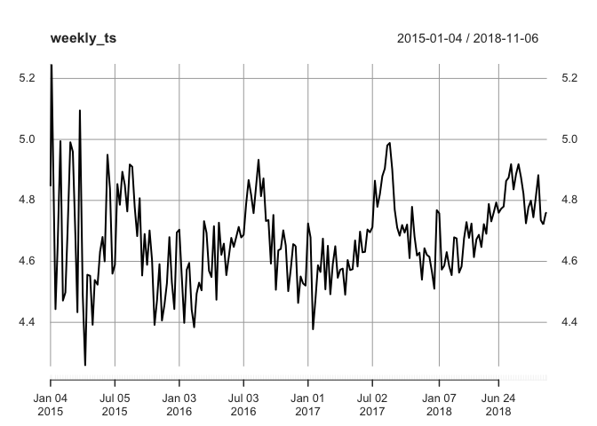
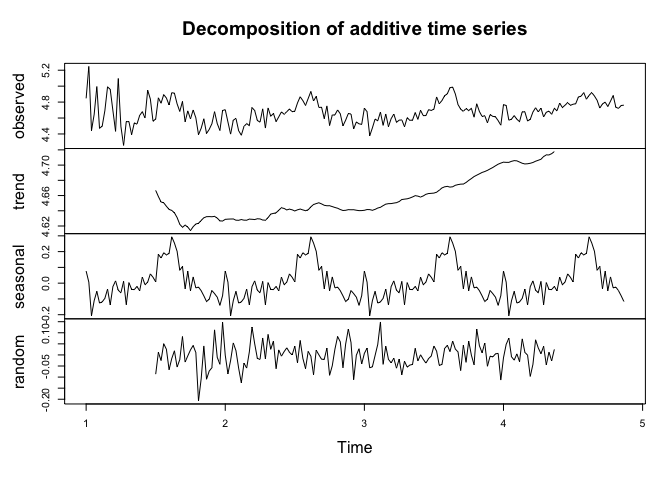
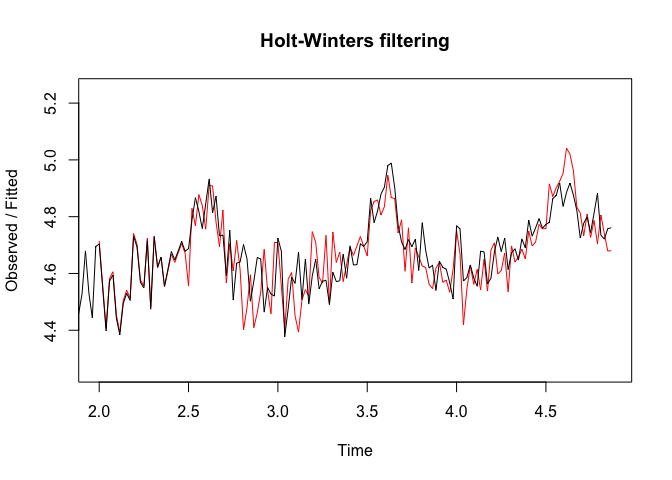
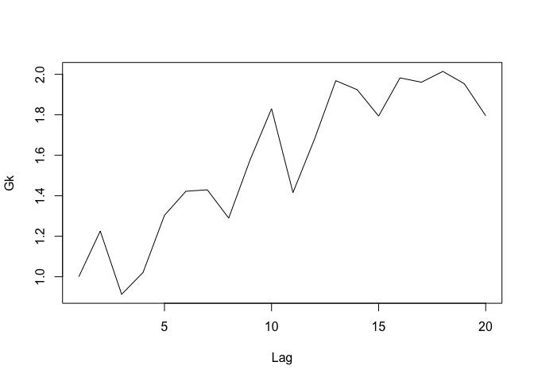
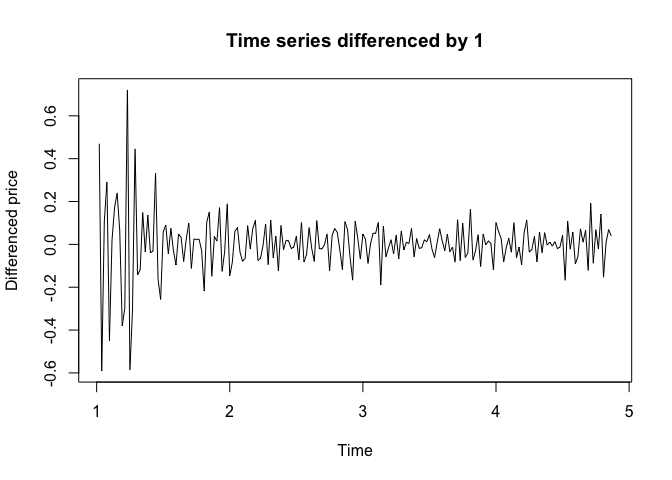
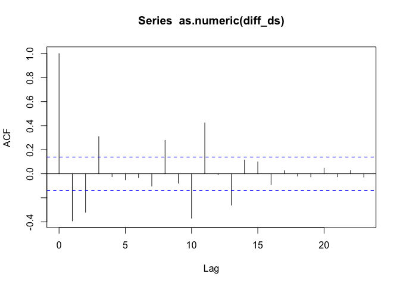
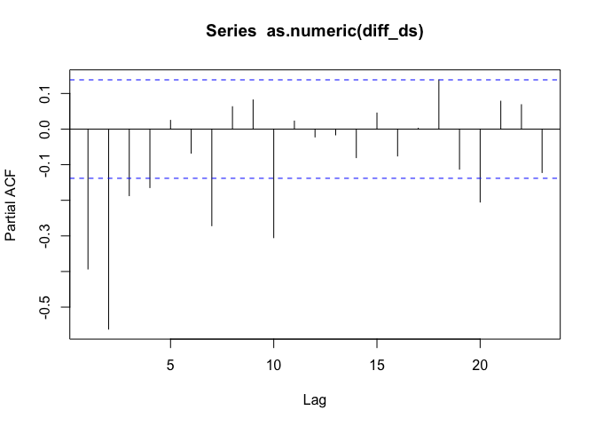
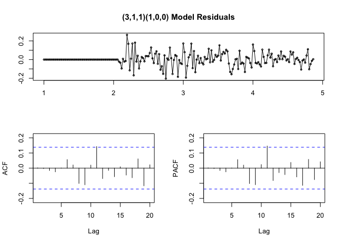
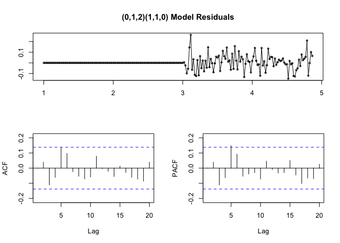
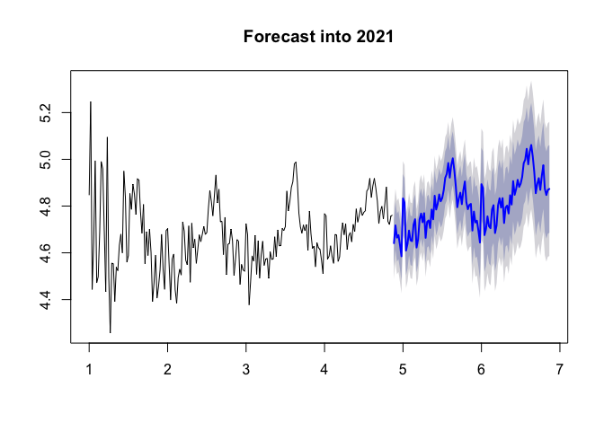

AirBnBProject
=============

The goal of this ongoing project is to build a consumer pricing tool for AirBnB hosts and guests to better understand the pricing trends in Vancouver. We hope that this will allow users to gain an insight into what they can expect to earn or pay for a given property type during the year.

This project will be split into four parts.

-   Part 1: Data Acquistion and Cleaning
-   Part 2: Data Visualisation and simple time series modeling
-   Part 3: ARIMA modeling
-   Part 4: HSFM model and Shiny app

Simple Models
=============

This section will fit a simple [Seasonal Exponential Smoothing model](https://en.wikipedia.org/wiki/Exponential_smoothing).
The first step will be to visualize the time series data.

``` r
#plot weekly time series
print(plot.xts(weekly_ts))
```




#### Decompoistion of time series

From the above we can see that there is a seasonal trend with surges in price in the summer months, which may be explained by increased number of tourists visiting the city during that period. The start of the time series also shows a greater variation in price than the following months, this may be explained by the fact that this was the time when Airbnb was launched in Vancouver and people did not know how to price their homes in the market initially, but this variation seems to stabilize as time progresses with the market adjusting to the demand of the houses.

Since there is a seasonal trend the in the time series, it was decomposed into its constituent elements: seasonality, trend and random noise.

``` r
#decompose time series
weekly <- ts(as.numeric(weekly_ts), frequency=52)
weekly_components <- decompose(weekly)

#plot decomposistion
plot(weekly_components)
```

 \

We can see that is a seasonality with price spikes in the summer. The trend also shows us that the prices initially start off quite high, followed by a drop and then a resurgence in price, possibly due to increased tourism and increased market activity. The remainder also shows that there is a lot of noise at the start, again due to uncertainty about to price a house. This slowly gets better with less variation, due to prices settling down.

Before trying to fit an ARIMA model, a Holt-Winter model was fit. This is a simple seasonal exponential smoothing model that was used as a baseline, and every other model built was compared to this.

``` r
exposmoothing_forecasts <- HoltWinters(weekly,seasonal = 'additive')
plot(exposmoothing_forecasts)
```



``` r
#create a test set and training set
test <- window(as.numeric(weekly), start=183)
train <-window(as.numeric(weekly[1:182]))
train <- ts(train,frequency = 52)

#train models on subset of data
holtWint <- HoltWinters(train,seasonal = 'additive')

#get forecats for holdout set
hwint_fcast <- forecast(holtWint,h=20)
accuracy(hwint_fcast,test)
```

    ##                       ME       RMSE        MAE        MPE     MAPE
    ## Training set  0.01209961 0.08191240 0.05866524  0.2462716 1.259521
    ## Test set     -0.03107583 0.08330497 0.06437858 -0.6439191 1.334484
    ##                   MASE       ACF1 Theil's U
    ## Training set 0.5335281 0.09714874        NA
    ## Test set     0.5854878 0.17338273  1.383647

The above seasonal smoothing model had a fairly good RMSE on the holdout set. More sophisticated methods can be used to validate the model accuracy than a simple holdout set, but it is a good starting point to keep things simple.

The model that was fit by R is the following:


The above recursion equations are intialized according to the deafult R method. The parameter estimates are:

- *α* = 0.003607012 
- *β* = 0.3482321 
- *γ* = 0.6589511

The seasonal parameters are not included for berivity. 

The red line shows the predictions made by our simple seasonal exponential smoothing model. It clearly seems to follow the trends quite nicely, however there are parts that dont line up exactly. Nonetheless it a good starting point.

ARIMA Model
-----------

Fitting an ARIMA model requires the assumpition that the time series is stationary. A series is said to be stationary when its mean, variance, and autocovariance are time invariant. A visual inspection shows that the time series may not neccesarily be stationary. To confirm this a Variogram and a formal ADF (augmented Dickey Fuller Test was conducted).

Model
-----

ARIMA(*p*, *d*, *q*)(*P*, *D*, *Q*)<sub>*S*</sub>

The ARIMA model will be used.To find the parameters for this model ACF and PACF plots wil be used. Parameters:

- p: non-seasonal AR component 
- d: non-seasonal differencing order
- q: non-seasonal MA component 
- P seasonal AR component
- D: seasonal differencing order 
- Q: seasona MA component
- S: season period

The steps to determine them will be:

1.  Decompose timeseries into seasonal and non-seasonal parts
2.  Determine p,d,q components of this part via acf,pacf and test running ARIMA models
3.  Repeat 2 for P,D,Q
4.  Fit model with found parameters and season. See if anything can be improved through changing parameters a littl more

Note ARIMA models work on the assumption of stationarity.

Testing stationarity
--------------------

``` r
#testing stationarity
adf.test(weekly,alternative = "stationary")
```

    ## 
    ##  Augmented Dickey-Fuller Test
    ## 
    ## data:  weekly
    ## Dickey-Fuller = -3.4953, Lag order = 5, p-value = 0.04448
    ## alternative hypothesis: stationary

``` r
#Variogram defintion: 
#G(k) = Var(zt+k - zt)/Var(zt+1 - zt)
Var <- var(diff(weekly,lag=1))
Gk <- vector(mode='numeric',length=48)
for (k in 1:48){
    Gk[k] <- var(diff(weekly,lag=k))/Var
}

plot(1:20,Gk[1:20],ylab='Gk',xlab='Lag',type='l')
```



Both the ADF test and the Varoigram suggest that our time series is borderline not stationary. A variogram for a stationary time series should level out, however this is clearly increasing. The above Variogram shows a clear trend. This suggests a simple differencing by 1 or 2 steps may needed.

    ## Warning in adf.test(diff_ds, alternative = "stationary"): p-value smaller
    ## than printed p-value

    ## 
    ##  Augmented Dickey-Fuller Test
    ## 
    ## data:  diff_ds
    ## Dickey-Fuller = -8.0098, Lag order = 5, p-value = 0.01
    ## alternative hypothesis: stationary

 

The time series was differenced by 1-step as seen above. The new differenced time series appears to be stationary thus we assume `d = 1` in our model. To determine the other parameters the ACF and PACF were plotted.



The ACF plot shows lags 1 and 2 are signficant(pssibly some later ones), while the PACF shows that lags 1,2,3 are signficant. (possibly lags 11 and 12, but we can ignore those for now to keep things simple).

`p = 3` `q = 2`

Since there are a lot of signficant lags, it might be hard to decide what parameters to choose for the model. A good starting point is the auto.arima() function. This find the best fitting model based on either AIC or BIC. From the above acf and pacf plots a ARIMA(3,1,2) may be approriate. Another method to decide an intial model is to use the ```auto.arima()``` function, part of the forecast package.

    ## Series: diff_ds 
    ## ARIMA(3,0,1) with zero mean 
    ## 
    ## Coefficients:
    ##          ar1      ar2     ar3      ma1
    ##       0.1279  -0.1882  0.3527  -0.9108
    ## s.e.  0.0962   0.0834  0.0913   0.0609
    ## 
    ## sigma^2 estimated as 0.009473:  log likelihood=184.22
    ## AIC=-358.44   AICc=-358.13   BIC=-341.92

 

The above models and residuals look good. There are no significant PACF or ACF lags. Several other ARIMA models were fit and the RMSEs were compared. It was found that an ARIMA(0,1,2)(1,1,0) model produced the lowest RMSE value.



``` r
#train model
fitbest <- arima(weekly,order=c(0,1,2),seasonal = list(order=c(1,1,0),period=52),method='CSS')

#view predictions
fcast <- forecast(fitbest,h=104)

plot(fcast,main='Forecast into 2021')
```



Contributors
------------

Ash Sandhu \\ Akbar Ali Qazi \\ Mark Kopani

